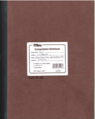
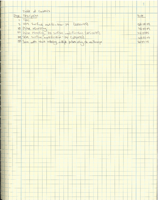
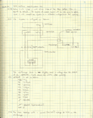
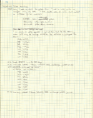
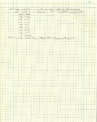

Title: Effective Lab Notebooks
Date: 2014-02-27 22:50
Category: Blog
Author: Joshua Ryan Smith
Summary: Successful lab notebooks

Summary
=======
* Lab notebooks are collections of entries describing experiments performed in a lab.
* Use a bound, paper [lab notebook](http://www.amazon.com/exec/obidos/ASIN/B00007LV4B). It needs to have page numbers.
* Write in pen.
* Give each new lab notebook a uniquely identifying label: `<researcher's name> Lab Notebook <YYYY-MM-DD>`.
* Put coordinates (email, phone, office) of the owner of the lab notebook on the cover of the notebook.
* Create a table of contents in the front four pages.
* Each new entry should have a date (YYYY-MM-DD), a title, and start on a new page.
* Entries should start with a plan of the experiments to be performed, contain notes and data as the experiment is performed, and at then end have a reflection of the experiment just performed.

Introduction
============
Here are some notes on how to maintain a lab notebook based on my experience as a working scientist. I've found that this approach increases the value of my lab notebooks by giving a structure to the information I'm recording so I can spend more time thinking about the experiments I'm doing instead of what I should or shouldn't be writing down. Also, this system makes all the information recorded in your lab notebooks addressable and therefore easily cross-referenced. Finally, the information is recorded at several levels of detail, increasing the findability and contextualization of specific bits of information.

Lab notebooks are where the realtime narrative of science is recorded. Lab notebooks are indeed narrative, but have a partular structure so that people can understand the important details and sequence of scientific events at a later date (note "people" includes the person who wrote the notes). The lab notebook should be written in such a way that even years or decades later, a reader can reliably reconstruct the events. The structure is to enhance the readability by making the information contained within more precise.

Lab notebooks should include all of the organizational features that real technical books have evolved over the centuries: a name (a.k.a. title), a table of contents, and sectioning. The fundamental unit of a lab notebook is the entry.

Naming
======
Every lab notebook should be named with a unique identifier (UID). Even if you don't follow my recommended naming scheme, giving each lab notebook a UID is critically important. Your institution may have its own naming scheme. I recommend the following:

	<Researcher's name> Lab Notebook YYYY-MM-DD

Researcher's name is the full name of the researcher. I like to include the literal "Lab Notebook" so that readers can understand that a lab notebook is being referenced when the name is written down in a cross-reference. The final piece is the four-digit year, the two-digit month, and the two-digit day. Not only do I like this date format, it is an [international standard](http://en.wikipedia.org/wiki/ISO_8601).

This naming scheme has several advantages. It encodes the owner's name so that someone is responsible for the notebook's contents and so that credit can be attributed when papers are being written. The date string acts as an index for the notebook, albeit not sequential. Indexing with the date alleviates owners of lab notebooks from having to remember a running index of their lab notebooks every time they start a new one, thus helping to prevent name collisions. In addition, the date used as an index gives at-a-glance context for the contents of the notebook. Since it will likely take longer than a single day to fill a lab notebook, using the date as an index is unlikely to result in a naming collision.

I recommend writing the name on the front of the notebook and on its spine. A [silver sharpie](http://www.amazon.com/exec/obidos/ASIN/B00009RAX4) shows up well on the black spine of my [recommended notebook](http://www.amazon.com/exec/obidos/ASIN/B00007LV4B).

The coordinates of the notebook owner should also be written on the front of the notebook: email, phone, and office address.

Table of Contents
=================
When starting a new lab notebook, I recommend reserving the first four pages for the table of contents if your notebook doesn't already have one. The actual table should have three columns: the left is the page number. Center: title of entry with sample numbers in parantheses. The right: date. The table of contents is an at-a-glance record of what is included in the notebook and makes the reader's job of comprehending the contents of the lab notebook much easier. You should add TOC information at the time you create a new entry.

Entry Metadata
==============
Entries are the raison d'être of a lab notebook. The platonic ideal of a lab notebook entry is probably a single experiment. However, I've found that in reality my entries tend to capture single days in the lab. Before getting to what an entry should contain, every entry should include the date and title as metadata. Again, record the date in ISO 8601 format: YYYY-MM-DD. I record it on the top margin, left column. Every entry should have a title. I write it in the center of the top margin. Write a descriptive and concise title. Writing titles is very challenging, but gets easier with practice. Writing titles in this way has a strong focusing effect on your thinking, forcing you to cut inessential information.

Every new entry should begin on a new page. There's no advantage to trying to conserve paper by doubling up entries on the same page. Obviously, some entries are going to span multiple pages and that's ok. If avoidable, entries *should not* span separate lab notebooks. If they do, make sure to include the necessary back-references.

Just to reiterate: add the entry to the table of contents at the time you create the entry. Your future self will thank you.

Contents of an Entry
====================
So what should an entry contain? Generally speaking, I try to have three parts to my lab notebook entries: plan, record, and reflection. First, I write a description of the plan for the experiment. This section may include drawings of the experimental setup, block diagrams or schematics for instrumentation, etc. I may refer to papers in the literature. Don't short-change this subsection; writing your plan of work forces you to think through the problems you might encounter and gives you time to solve them before your experiment is underway.

After the plan comes the main record of the experiment. The goal is to note every event that happens (valve #3 opened, power supply switched on, pump switched off) on a new line with the time of the record written in the left margin in 24h format (e.g. 15:27, not 3:27pm). I will record the names of computer files that are produced in the course of the experiment. I will also record instrumentation metadata like the setting on a potentiometer, or a temperature. Regarding instrumentation metadata, I make every effort to only record information once. In other words, I will record the settings on instrumentation if those settings are not being recorded in the computer data files that end up being saved in the course of the experiment. Every effort should be made to record *ALL* the conditions of the instrumentation, especially settings that rarely or never change. I treat this step as a kind of ritual -- you might be surprised how often this ritual turns up instrumentation settings that should never change, but have. This ritual also gives you a very detailed understanding of your experimental setup and therefore reduces systemic mistakes. To ease the drudgery, I will create [worksheets](https://github.com/jrsmith3/tfan_experiment_worksheets) for types of experiments I frequently repeat that I paste into my lab notebook (double-sided [tape](http://www.amazon.com/exec/obidos/ASIN/B0035LXTYU), actually). Any irregularities or unexpected occurences should be recorded as well (power failures, dropping samples, etc.).

Once the experiment is over, I recommend writing a brief summary of what happened, how the results fit into your understanding of the bigger picture, and where you might go next. Again, don't short-change this subsection either. The present experiment's connection to all other aspects of your research will never be as clear in your mind as it is immediately after it is over.

Despite the regimented structure I describe above, note well that above all else you are writing a narrative for an audience. Write what will be most helpful to your future readers (particularly your future self) and write it in a way that is readable (enjoyable, even). Writing good lab notebook entries is an art like all other writing exercises: you improve with practice. It is more important to write bad sentences than no sentences. Focus on recording your data and instrumentation settings accurately and eventually you will learn the appropriate level of narrative detail.

Added Advantages
================
Structuring your lab notebook in the way I describe yields several benefits. First, the structure, particularly the fact that the notebook name is a UID, makes all the information in all of your lab notebooks easily addressible. You can refer to a precise event using the name of the notebook, page number, and timestamp of event. Second, having a structure reduces your cognitive load which allows you to focus maximum attention on your work. Third, the table of contents along with descriptive entry names, sample numbers, and dates gives a high-level overview of the contents of the lab notebook.

General Advice
==============
In order to avoid entries that span notebooks, archive your notebook when an entry cuts into the last 15 pages.

Paper notebooks are better than electronic notebooks in my experience. Electronic notebooks have some advantages (publishing, copying) but paper's advantages outweigh them. Paper is malleable in that you can draw whatever you like. It is immediate: you don't have to power it up, log in, etc. so you are more likely to use it. Paper doesn't have DRM or legal restrictions/licensing fees, etc.

Pre-bound notebooks should be used instead of loose-leaf notebooks. Pre-bound notebooks show tampering. They are better for patent claims and tech transfer (in a way that no attorney has sufficiently explained to me).

Like samples and sample logs, lab notebooks should be stored in a central location.

Don't tear pages out of lab notebooks. All this advice also applies to [cleanroom notebooks](http://www.amazon.com/exec/obidos/ASIN/B0054RIENY)
