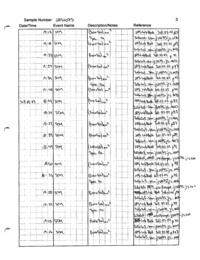
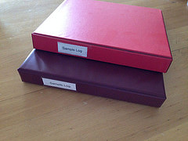
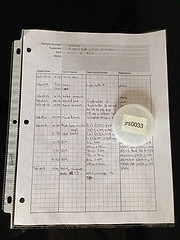

Title: Sample logs - the secret to managing multi-person projects
Date: 2014-04-02 22:55
Category: Blog
Author: Joshua Ryan Smith
Summary: How and why to keep sample logs to manage multi-person projects.

<!-- Having embedded CSS is a hack, but I want the images to be side-by-side. 
I stole this CSS from: https://ghost.org/forum/using-ghost/1931-markdown-inline-images/
-->

Summary
=======
* A [sample log](https://github.com/jrsmith3/sample_log/releases/download/2014-11-19/sample_log.pdf) is a record of all the events a sample experiences.
* Sample logs are necessary, especially if sample processing/analysis steps are preformed by different people.
* The fundamental unit of a sample log is an entry.
* Entries should be recorded at the time of event, not before or after.
* Each entry should record four pieces of information: 
    * A date/time stamp in [YYYY-MM-DD HH:MM format](https://en.wikipedia.org/wiki/ISO_8601) where HH:MM is in 24h format.
    * The event name.
    * A brief description.
    * Cross-references -- particularly lab notebooks and computer data files.
* Sample logs should be stored alphabetically according to sample name in [three-ring 1" binders](http://www.amazon.com/exec/obidos/ASIN/B0006HVEI4) in a central location.
* When moving between people and experiments, sample logs should be placed in [plastic page protectors](http://www.amazon.com/exec/obidos/ASIN/B00006IC89) along with the sample in its case.

Introduction
============
A sample log is a record of all the events that a sample experiences. Sample logs are just as necessary as lab notebooks because they capture a set of information that simply isn't captured in a lab notebook. The necessity of such a record is particularly clear in projects where samples undergo process and analysis steps by many different people. Samples tend to move from place to place and from person to person; they have complex and eventful lifecycles.

 

You may think, "What purpose does a sample log serve? Isn't this information contained in lab notebooks?" In contrast to a lab notbook, a sample log won't contain a long narrative description of an experiment; it only contains a list of brief records of every event the sample experiences. Each entry contains the bare minimum amount of information with generous cross-referencing to the relevant lab notebooks and computer data files. In this way a reader of the sample log can comprehend the entire lifecycle of a sample, and the reader can follow the cross-references to find more details about particular events. There is not another source of information that provides these features. 

Sample logs and lab notebooks are good compliments to one another since they contain different types of information and serve different purposes -- the information in one is enhanced by the information in the other. In principle, a sample log could be constructed from the entries in a lab notebook, but in practice this task would be very time consuming -- especially since the records are likely split over multiple lab notebooks belonging to multiple people.

Sample logs are composed of two components: metadata and the list of entries.

Sample log metadata
===================
The metadata section contains information about the sample. Obviously, the sample log should include the sample's name. The sample's name should be unique (a method for choosing unique sample names will appear in a later post). Using unique names for samples gives you the added bonus of getting a unique name for your sample log.

Beyond sample name, required metadata depends on the needs of individual labs. I've found it useful to record the size of the sample, the substrate, the manufacturer/supplier, and the manufacturer's metadata (lot number, etc.). Doping, structure, etc. is appropriate to record here.

Sample log entries
==================
Entries are the fundamental unit of the sample log. Every time the sample experiences an event, an entry should be recorded. Each entry should have four components: date/time stamp, event name, brief description, and cross-reference. Entries should be recorded in pen. Each entry should be recorded on a new line.

 

Date/time stamp
---------------
Each entry should have a date and time in [YYYY-MM-DD HH:MM format](http://en.wikipedia.org/wiki/ISO_8601). The time should be in 24-hour format which eliminates ambiguity. It is equally plausible that "8:45" refers to something that happened in the morning or the evening. On the other hand, "20:45" can only mean the evening.

Event name
----------
The entry should name the event. Obviously, events that change the nature of the sample should be recorded: material deposition, material removal, annealing, and things of that sort. Additionally, experiments that characterize the sample should also be recorded: e.g. [XPS](http://en.wikipedia.org/wiki/X-ray_photoelectron_spectroscopy), [AFM](http://en.wikipedia.org/wiki/atomic_force_microscope), [XRD](http://en.wikipedia.org/wiki/x-ray_diffraction), I-V characterization of devices, etc. Third, it is generally useful to record the location of the sample: mounting to a sample holder, loading and unloading into an instrument, etc.

Event description
-----------------
Every entry should also include any necessary, but brief, description. The description should not go into great detail about the experiment (detail should be recorded in the lab notebook), but it is sometimes useful to annotate the difference between events. For example, if the event is that the sample was loaded, the description would be the instrument. If the event is AFM is performed on the sample, the description might be the scan size (e.g. 1μm × 1μm). There isn't a hard and fast rule for what info should be recorded as the description, but its more based on the experience of the person writing things down.

Cross-reference
---------------
Finally, the records should have one or more cross-references, if applicable. Cross-references usually point to a page in a lab notebook or a filename. Since your lab notebook has a [unique name](https://jrsmith3.github.io/http://localhost:8000/effective-lab-notebooks.html), the cross-reference might look something like `JRS Lab Notebook 2014-02-27 p14`. If the event you are recording results in a computer data file, the cross-reference to the [uniquely named](https://jrsmith3.github.io/naming-files-uniquely-to-reduce-confusion.html) computer file might look like `20140217-2355_stm_0001_jrs.dat`. 

Many times, an entry will have multiple cross-references. Put each cross-reference on a new line.

There are some events that probably don't require a reference. For example, loading a sample into an instrument won't likely have a reference unless there was some unusual circumstance associated with it, in which case the details should be recorded in a lab notebook and the reference noted on the sample log. 

When should a new sample log be created vs. a new entry in an existing log?
==========================================================================
A sample log should be started every time a sample is created. In my experience, it is best to consider each new individual piece of material as a unique sample. From this definition, there are only two events that would result in creating a new sample log:

* Taking a new wafer out of the package from the manufacterer.
* Dicing/cleaving an existing wafer.

All other semiconductor processing and analysis to an existing sample would simply result in entries added to that sample's log. Examples of typical semiconductor processing are:

* Metal deposition via evaporation or sputtering.
* Wet etch.
* Plasma/RIE/dry etch.
* PECVD of dielectric.
* Lithographic patterning.
* Annealing.
* Etc.

Note also that a single sample can contain many devices. You can imagine a photolithography mask with tens of Schottky diodes patterned on a single 10mm x 10mm die. The die would have its own sample log; C-V measurements done on an individual diode would generate an entry in that sample's log.

Does this advice apply to your lab?
===================================
What follows is a list of tips based on my experience working on projects at the intersection of device physics, surface science, materials science, and electrical engineering. I usually work with the typical materials science samples: mainly semiconductor wafers (Si, SiC, GaN) or insulating wafers (sapphire). I usually deal with some surface science analysis like XPS, AES, LEED, STM, or AFM. I also deal with processing steps like photolithography and metallization and analysis of fabricated devices like IV and CV measurements or microanalysis via SEM or EBIC. Samples usually start as 2" or 4" wafers and then are diced into smaller pieces during processing. If your work isn't based on wafers like mine, this approach may not apply. Also, my experience is in research science and not industrial process engineering or fab. I know the advice I give in this post applies to operations that deal with tens to a few hundred samples per year with a group encompassing four to around twenty people.

Recommendations
===============
Creating and maintaining sample logs is a continual occurance and so I've created a [worksheet](https://github.com/jrsmith3/sample_log/releases/download/2014-11-19/sample_log.pdf) (and the [repo](https://github.com/jrsmith3/sample_log)). For what its worth, I used an open-source program named [scribus](http://scribus.net) to generate this worksheet and I've licensed it [CC-BY 4.0](https://creativecommons.org/licenses/by/4.0/) to make it easy for others to modify it for their own needs.

I recommend printing these worksheets instead of attempting to keep electronic sample logs. The advantages of electronic files (copying, publishing) aren't terribly beneficial for sample logs. On the other hand, electronic sample logs introduce issues of synchronization, backups, and findability.

The sample log worksheet PDF is two pages. Once the two pages have been filled, the second page of the PDF can be printed and appended to the log. When a new page is appended, write the sample name at the top and the new page number at the bottom right in the spaces provided. If every new sample log page is marked with the sample name and page number, then that page implicitly gets a unique identifier (e.g. page n of the sample log of sample x). Thus, if someone finds the page lying on the ground, it is easy to return it to its proper place.

I recommend punching holes in the sample logs with a three-hole punch (or printing them on pre-punched paper) and storing them in [one-inch binders](http://www.amazon.com/exec/obidos/ASIN/B0006HVEI4). I've found that in larger binders, pages flop around and eventually rip out. Don't pack the binder full, just start a new binder once the current binder starts to get full. I recommend labeling the binder(s) with "Sample Log" on the spine. I recommend against indexing the sample logs because I recommend adding individual sample logs alphabetically according to sample name (in other words, don't mark the binders with anything beyond "Sample Logs"). I'll go into more detail later with a recommendation on how to uniquely name samples so that their index grows chronologically. In that way, inserting new sample logs into the middle of a sample log is a rare occurance. Thus, once a binder gets filled, its unlikely that additional sample logs will need to be added which prevents shuffling sample logs through binders to make room.

Binders containing sample logs should be kept in a central location, preferrably in the same location as lab notebooks and samples. Despite the binder suggestion, sample logs should travel with their sample as the sample moves from place to place. I've found that [plastic page protectors](http://www.amazon.com/exec/obidos/ASIN/B00006IC89) are good for this purpose. If your sample is up to a 4" wafer, the wafer carrier can be slipped inside the plastic sleeve with the sample log and the entire packet can be passed between researchers. If any of the sample processing or analysis occurs in the cleanroom, sample logs should be printed on cleanroom paper.

