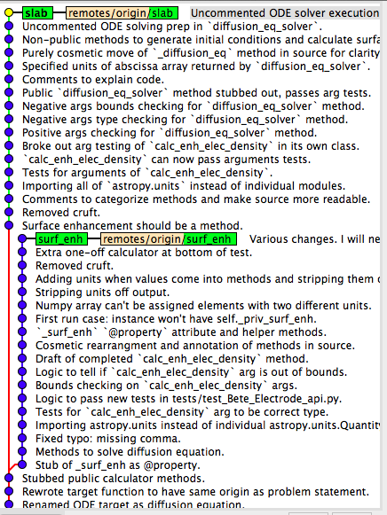

Title: Scratchwork branches
Date: 2014-06-26
Category: Blog
Author: Joshua Ryan Smith
Summary: What should I do with a scratchwork branch in my git repo?

I have a question that I'd like to pose to more advanced software developers if any are out there.

Yesterday I wrote some code and tests to implement some medium-complex functionality (branch `surf_enh` in the picture). The result was ok, but I ended up with a situation where I had painted myself into a corner. So today I started over pretty much from scratch; I reverted back to the point in the repo where I had started yesterday, and applied the lessons I had learned (branch `slab`) while avoiding the cul-de-sac I ended up in yesterday. A lot of the code in `slab` is copied from `surf_enh` with some minor modifications.

My question is: what do I do with branch `surf_enh`? I'm thinking about this branch in terms of an early draft of a manuscript; some days you write copy with the understanding that you will pretty much completely rewrite it from scratch on a subsequent revision. When I write manuscripts or papers, I like to keep earlier revisions for posterity. Similarly, I would like to keep the commits and commit messages in `surf_enh`. However, it seems like keeping a whole named branch in the repo would be crufty.

Do you ever see this pattern where you have a scratchwork branch in your repo that you subsequently completely refactor? If so, do you keep these scratchwork branches? How do you prevent them from crufting up the list of branch names? Should I use a tag?
