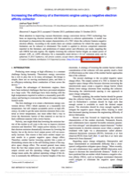

Title: Handling citations in an early draft of a document
Date: 2015-06-12
Category: Blog
Author: Joshua Ryan Smith
Summary: Use DOIs or ISBNs as keys to uniquely identify reference material in a technical document

The problem: handling citations is a pain
=========================================
Dealing with citations in a document can be tedious, especially when done by hand. From my experience, the tedium falls into one of two categories:

1. **Formatting** -- There are many different ways to format a citation appearing in a bibliography (MLA, Chicago, etc.). Formatting by hand usually requires tedious copy/pasting or re-keying data that's already available.
2. **Organization** -- Oftentimes citations appear in the bibliography in the order in which they appeared in the text. Managing such a list by hand becomes extremely difficult as the number of citations increases, particularly if a citation needs to be inserted in the middle of the list and the subsequent citation numbers need to be incremented.

During the initial drafts of a document, this tedium can be especially disrupting. My suggestion is to put a unique identifier for each citation in the body of the text instead of trying to wrangle the order and formatting of the citations during the early stages. Many books and academic papers already feature an "official" unique identifier: the DOI or ISBN.

The solution: unique identifiers
================================
Your first thought might be, "The solution is to use [reference management software](https://en.wikipedia.org/wiki/Comparison_of_reference_management_software)." This approach is on the right track, but the real secret sauce is to use unique identifiers to cite works within the document. Using unique identifiers to cite works within the document renders the choice of reference management software arbitrary.

Where to find a source's unique identifier
------------------------------------------
Conveniently, most papers found in the peer-reviewed literature are uniquely identified by a number called a "[digital object identifier](https://en.wikipedia.org/wiki/Digital_object_identifier)" or DOI. An example of a DOI is [10.1063/1.4826202](http://dx.doi.org/10.1063/1.4826202); the DOI is usually printed somewhere on the paper as shown in the following image (click to enlarge):

[Crossref's metadata search](http://search.crossref.org) is an incredibly useful tool for resolving a paper's website or DOI from an item in a bibliography. Typing in a paper's title and a few other identifying bits of information (author, year, journal) is usually enough for Crossref's metadata search to return the correct result with the DOI.

You might have noticed that the DOI in the above example image is part of a URL. Conveniently, there is a DOI resolver on the web. Simply typing the URL `http://dx.doi.org/` and pasting the DOI after the final `/` into your web browser will resolve to the page on which any particular paper is hosted.

Similarly, books are identified by a number called an "[international standard book number](https://en.wikipedia.org/wiki/International_Standard_Book_Number)" or ISBN. Nowadays, books are issued with 13 digit ISBNs, but in the past ISBNs had 10 digits. The ISBN can almost always be found as the numerical part of the bar code located on the back cover, or on the first page or two inside the book. I generally use [Amazon.com](http://www.amazon.com) to find the ISBN corresponding to a book.

How to use the DOI or ISBN in your document
-------------------------------------------
Now that you know where to find unique identifiers for papers and books, my suggestion is to just paste or type in the unique ID anywhere you want to cite something. For example:

> Using Smith's model [**10.1063/1.4826202**] we estimated the output power density of the device to be...

Where the bolded number (10.1063/1.4826202) is the DOI for the paper being cited. Another example separating multiple citations with commas:

> Goano has presented a similar derivation for the complete and incomplete Fermi-Dirac integrals [**10.1016/0038-1101(93)90143-e**, **10.1145/210089.210090**].

Again, the DOIs in the above example are 10.1016/0038-1101(93)90143-e and 10.1145/210089.210090.

Eventually the manuscript will reach a point where you are ready to build the bibliography. If you are using reference management software, the DOI or ISBN can be used to identify each reference in the bibliographic database. If you've been using unique IDs in the body of the manuscript, it is trivial to apply your reference manager to build the bibliography with minimal tedium.
